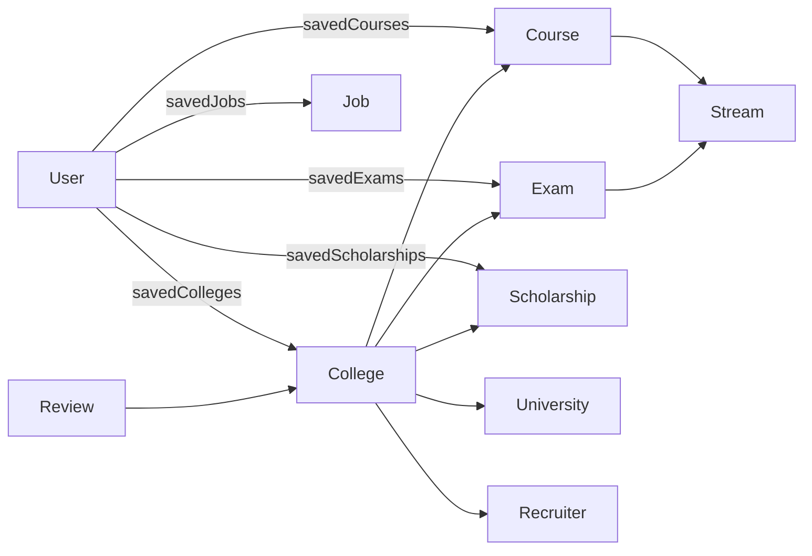

# Clarix database schema

The API uses **MongoDB** with **Mongoose**. The logical database name comes from `DB_NAME` in the server environment (for example `Clarix`). Each Mongoose model maps to a **collection** named from the model (typically lowercase pluralized by Mongoose, e.g. `User` → `users`).

---

## Entity relationship overview



**Note:** In `College`, the field `entranceExam` uses `ref: 'EntranceExam'`, but exams are registered as model **`Exam`**. Populate will only work if the stored `ObjectId` values match documents in the `exams` collection and you use `ref: 'Exam'` (or the model names are aligned). Worth verifying in API code and seeds.

---

## Core domain collections

### `User`

| Field | Type | Notes |
| --- | --- | --- |
| `name` | string | required |
| `email` | string | required, unique, lowercased |
| `mobileNumber` | string | required, unique |
| `password` | string | optional; min length 6 when set |
| `otp` | string \| null | |
| `otpExpiresAt` | date \| null | |
| `isVerified` | boolean | default false |
| `role` | `'student' \| 'admin'` | default `student` |
| `savedColleges` | ObjectId[] | ref `College` |
| `savedCourses` | ObjectId[] | ref `Course` |
| `savedExams` | ObjectId[] | ref `Exam` |
| `savedScholarships` | ObjectId[] | ref `Scholarship` |
| `savedJobs` | ObjectId[] | ref `Job` |
| `createdAt` / `updatedAt` | date | `timestamps: true` |

### `UserSignupOtp`

Pending signup flow: `name`, `email` (unique), `mobileNumber`, `passwordHash`, `otp`, `otpExpiresAt`, plus timestamps.

### `Stream`

| Field | Type | Notes |
| --- | --- | --- |
| `name` | string | required |
| `image` | string | required |
| `collegesCount` | number | required, ≥ 0 |
| `examsCount` | number | default 0 |
| `enabled` | boolean | default true |
| timestamps | | yes |

### `University`

| Field | Type | Notes |
| --- | --- | --- |
| `name` | string | required, unique |
| `type` | enum | `'Public' \| 'Private' \| 'State' \| 'Central' \| 'Deemed'` |
| `state`, `city` | string | required |
| `establishedYear` | number | 1800 … current year |
| timestamps | | yes; `versionKey: false` |

### `Recruiter`

| Field | Type | Notes |
| --- | --- | --- |
| `companyName`, `jobTitle`, `hiringDuration` | string | required |
| `logo`, `industry` | string | optional |
| timestamps | | yes; `versionKey: false` |

### `Course`

Rich marketing-style content: `name`, `shortDescription`, `stream` (ObjectId → `Stream`), `type` (`'Full Time' \| 'Part Time' \| 'Online' \| 'Distance' \| 'Other'`), `duration`, `fees`, `intakeCapacity`, `eligibility` (string[]), `cardImage`, `heroImage`, plus nested objects:

- **`description`:** `title`, `content`, `image`
- **`whyChoose`:** `title`, `description`, `reasons[]` { `title`, `description` }
- **`syllabus`:** `title`, `semesters[]` { `title`, `topics[]` }
- **`careerOpportunities`:** `title`, `items[]` { `title`, `description` }
- **`about`:** `title`, `description`, `points[]` { `title`, `description` }
- **`faqs`:** `title`, `description`, `items[]` { `question`, `answer` }

Timestamps enabled; `versionKey: false`.

### `College`

Large document tying together academics, placements, admissions, fees, media, and FAQs.

**Identity & overview:** `name`, `state`, `city`, `type` (Public / Private / Government / Deemed), `rating` (0–5), `establishedYear`, `accreditation` (string[], required), `logo`, `brochure`, `description`, `university` (ObjectId → `University`, required), `students`, `campusSize`.

**Placements:** `averageSalary`, `placementPercentage`, `highestSalary`, `placementTrends[]` { `year`, `avgSalary`, `placementPercentage` }, `recruiters[]` → `Recruiter`, `recruitersCount`, internship/alumni metrics (`studentsWithInternships`, `avgStipend`, `ppoConversionRate`, `alumniInFortune500`, etc.).

**Courses:** `courses[]` → `Course`.

**Admissions:** dates (`applicationOpeningDate`, `applicationClosingDate`, `entranceExamDate`, etc.), `entranceExam` → ref **`EntranceExam`** (see note above), `admissionMode[]` { `mode`, `label`, `description` }.

**Fees (mostly strings):** `hostelFee`, `messFee`, `libraryFee`, `laboratoryFee`, `sportsFee`, `annualFee`, `avgAnnualFee`.

**Scholarships:** `scholarships[]` → `Scholarship`.

**Galleries:** `campusImages`, `hostelImages`, `labsImages`, `eventsImages` (string[]).

**FAQs:** `admissionFaqs`, `courseFaqs`, `feesPaymentFaqs`, `scholarshipFaqs` — each an array of { `question`, `answer` }.

**Campus life:** `campusLife[]` { `title`, `description`, `verified`, `tags[]`, `image`, `source`, `isActive` }.

**Other:** `category` (string). Timestamps; `versionKey: false`.

### `Exam`

| Field | Type | Notes |
| --- | --- | --- |
| `shortName` | string | required, stored uppercase |
| `fullName` | string | required |
| `registrationDate`, `examDate`, `resultPublishDate` | date | required |
| `qualificationRequired` | string[] | required |
| `collegesAccepting` | number | required |
| `officialWebsite`, `description` | string | required |
| `isActive` | boolean | default true |
| `logo` | string | required |
| `stream` | ObjectId | optional → `Stream` |
| timestamps | | yes |

Mongoose model name: **`Exam`** (collection typically `exams`).

### `Scholarship`

| Field | Type | Notes |
| --- | --- | --- |
| `scholarshipName` | string | required |
| `scholarshipType` | enum | Merit / Need / Government / Private / Sports / Minority / International |
| `fundingType` | enum | Full / Partial / Tuition Waiver / Stipend / One-Time Grant |
| `deadline` | date | required |
| `totalFundingAmount` | number | required |
| `description`, `officialWebsite` | string | required |
| `isActive` | boolean | default true |
| `status` | enum | `active` / `closed` / `upcoming` |
| timestamps | | yes |

### `Job`

| Field | Type | Notes |
| --- | --- | --- |
| `jobTitle`, `companyName` | string | required |
| `jobType` | enum | Full Time / Part Time / Internship / Contract / Freelance |
| `location` | string | required |
| `salary` | object | `min`, `max` (numbers), `unit`: `LPA` / `Monthly` / `Hourly` |
| `companyWebsite`, `employeeSize`, `industry` | string | optional |
| `shortDescription`, `aboutJob` | string | required |
| `aboutYou`, `aboutRole` | string[] | |
| `faqs` | { question, answer }[] | |
| `isActive` | boolean | default true |
| timestamps | | yes |

### `Blog` (exported as `BlogModel`)

| Field | Type | Notes |
| --- | --- | --- |
| `title`, `slug`, `content` | string | `slug` unique |
| `excerpt`, `thumbnail` | string | optional |
| `status` | `'Draft' \| 'Published'` | default Draft |
| `tags` | string[] | |
| `views` | number | default 0 |
| `date`, `readTime`, `category` | optional | |
| timestamps | | yes |

### `Review`

| Field | Type | Notes |
| --- | --- | --- |
| `userName` | string | required |
| `userAvatar` | string | optional |
| `reviewType` | `'College' \| 'Organization'` | default College |
| `collegeId` | ObjectId | ref `College` |
| `collegeName`, `city`, `course` | string | optional |
| `reviewDate` | date | default now |
| `content` | string | required |
| `status` | `'Pending' \| 'Approved' \| 'Rejected'` | default Pending |
| `isActive` | boolean | default true |
| timestamps | | yes |

---

## Content management (CMS) collections

These store **page-level JSON** for the marketing site (heroes, sections, links). All use timestamps unless noted.

| Model | Collection name (typical) | Purpose |
| --- | --- | --- |
| `HomePage` | `homepages` | `hero`, `streams`, `contentBlocks`, `careerHub`, `faq`, `location` sections with `enabled` flags |
| `AboutPage` | `aboutpages` | `hero`, `secondSection`, `thirdSection`, `fourthSection`, `keyStatistics` |
| `CareersPage` | `careerspages` | `heroSection`, `secondSection`, `thirdSection`, embedded `jobs[]` |
| `FooterCMS` | `footercms` | Footer copy, newsletter block, link groups (`exploreColleges`, `courses`, `exams`, etc.) |
| `CollegesPage` | `collegespages` | Colleges listing hero |
| `CoursesPage` | `coursespages` | Courses listing hero |
| `BlogPage` | `blogpages` | Blog listing hero, `searchFilters`, `newsletter` |
| `JobsInternshipsPage` | `jobsinternshipspages` | Jobs/internships listing hero |
| `ExamPage` | `exampages` | Exams listing hero |

**TypeScript vs schema:** `IAboutPage` in code declares `status: 'draft' | 'published'`, but the Mongoose schema in `aboutCMSmodel.ts` does not define a `status` field. Treat as documentation drift unless another layer sets it.

**HomePage schema vs types:** The `HeroSection` TypeScript interface includes `images` and `popularSearches`, and `StreamsSection` includes `items`; the strict Mongoose paths may not include every interface field—confirm at runtime for CMS payloads.

---

## Where the schemas live

| Area | Path pattern |
| --- | --- |
| Users | `Server/src/modules/users/model/` |
| Colleges / courses / universities / recruiters | `Server/src/modules/colleges/models/`, `courses/models/`, `universities/models/`, `recruiters/models/` |
| Streams, exams, scholarships, jobs, blogs, reviews | `Server/src/modules/*/model/` |
| CMS | `Server/src/modules/contentManagement/*/model/` |

---

## Local development: Client on port 3000

If `npm run dev` in **`clarix/Client`** fails with **`Cannot find native binding`** for **`@tailwindcss/oxide`** (or similar errors for **`lightningcss`** / **`@next/swc-*`**), native addons were likely **quarantined** after download (common for projects under **Downloads** on macOS) or **optional dependencies** did not install cleanly.

**Fix (macOS):** from the Client directory, clear quarantine on native modules, then restart dev:

```bash
cd clarix/Client
xattr -cr node_modules/@tailwindcss/oxide-darwin-arm64 \
  node_modules/lightningcss-darwin-arm64 \
  node_modules/@next/swc-darwin-arm64 2>/dev/null
NEXT_PUBLIC_API_URL=http://localhost:5000/api/v1 npm run dev
```

If problems persist, reinstall dependencies (as suggested by Tailwind’s error text):

```bash
rm -rf node_modules package-lock.json
npm install
```

**Port already in use:** if **`EADDRINUSE: :::3000`**, another Node process is still bound to 3000—stop it (`lsof -i :3000`) or run `next dev -p 3001`.

**API URL:** the client defaults to `http://localhost:8000/api/v1` in code; the server often uses **port 5000** from `.env`. Set **`NEXT_PUBLIC_API_URL=http://localhost:5000/api/v1`** (or match your server port) when starting Next.

**Monorepo lockfile warning:** if Next warns about multiple `package-lock.json` files, set **`outputFileTracingRoot`** in `next.config.ts` to this Client directory (see project `next.config.ts`).
